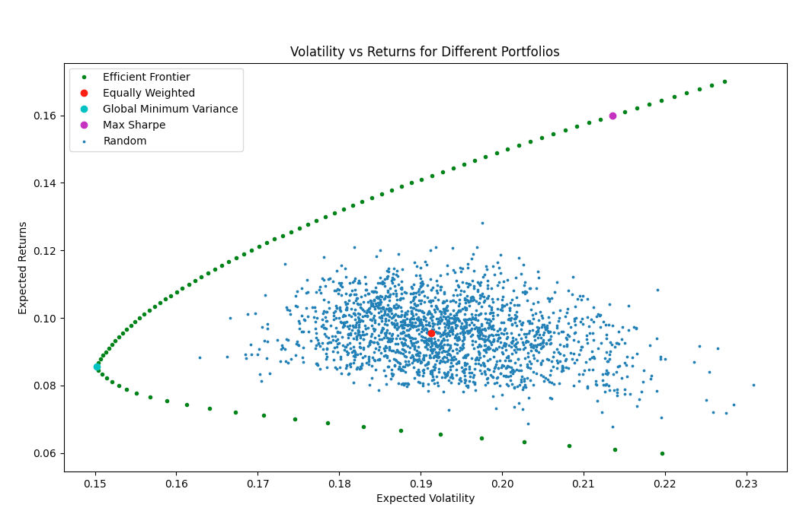
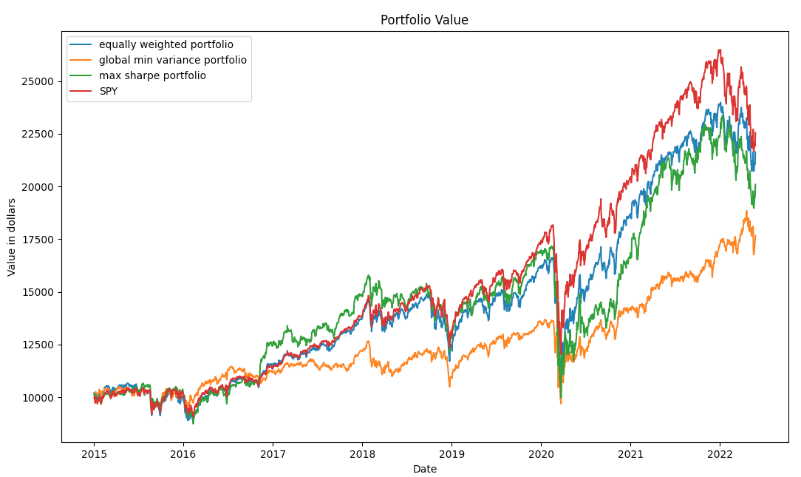

# Portfolio Optimization and Asset Allocation
This Github repository demonstrates the basics of Modern Portfolio Theorem, including the Global Minimum Variance Portfolio, Max Sharpe Portfolio, and Efficient Frontier, all implemented in Python.
## Quick Start
```
git clone https://github.com/zhuodannychen/Portfolio-Optimization
cd Portfolio-Optimization
pip install -r requirements.txt
python backtest.py
```
In backtest.py, the following values can be modified
```python
TICKERS = ['SPY', 'QQQ'] # List of assets in your portfolio
TOTAL_BALANCE = 10000 # Initial balance
start_date = 'yyyy-mm-dd'
end_date = 'yyyy-mm-dd'
bound = (0, 1) # Change to (-1, 1) if shorting is allowed
```
## Introduction
Assuming you have $100 and there are _N_ assets, how much money should you put into each asset to generate maximum profit? 
The Modern Portfolio Theorem refers to a tradeoff between risk and return. How can we allocate capital to maximize the returns given a certain level of risk? Similarily, how can we minimize risk given a certain level of return? There is no unique solution, but rather, a set of solutions that form what is called the efficient frontier.
## Monte Carlo Simulation
In our simulation, we use the following sectors: Technology, Consumers, Industrial, Materials, Financials, Energy, and Healthcare.
```python
TICKERS = ['VGT', 'VDC', 'VIS', 'VAW', 'VFH', 'VDE', 'VHT'] # Vanguard ETFs of different sectors
```
Then, we randomize the weights of each asset to generate random portfolios.
<p align="center">
  
</p>

As we can see, some portfolios performed better than other ones, meaning there has to be an optimized portfolio.
## Efficient Frontier
The efficient frontier is the set of portfolios that maximize returns given a level of risk.
## Equally Weighted Portfolio
The equally weighted portfolio allocates equal amounts of capital to each asset.
```python
def equal_weight(assets):
    optimal = [1/len(assets) for i in range(len(assets))]
    return optimal
```
## Global Minimum Variance
The global minimum variance portfolio is the portfolio with the lowest risk. In Python, it can be solved with ```scipy.optimize.minimize``` .
```python
def minimum_variance(ret):
    def find_port_variance(weights):
        # this is actually std
        cov = ret.cov()
        port_var = np.sqrt(np.dot(weights.T, np.dot(cov, weights)) * 250)
        return port_var

    def weight_cons(weights):
        return np.sum(weights) - 1


    bounds_lim = [(0, 1) for x in range(len(ret.columns))] # change to (-1, 1) if you want to short
    init = [1/len(ret.columns) for i in range(len(ret.columns))]
    constraint = {'type': 'eq', 'fun': weight_cons}

    optimal = minimize(fun=find_port_variance,
                       x0=init,
                       bounds=bounds_lim,
                       constraints=constraint,
                       method='SLSQP'
                       )

    return list(optimal['x'])
```
## Maximum Sharpe
[Sharpe Ratio]("https://economictimes.indiatimes.com/definition/sharpe-ratio") is the measure of risk-adjusted return of a portfolio. A portfolio with a higher Sharpe Ratio is considered superior to its peers. However, expected returns and risk should be known with certainty.

The Maximum Sharpe Portfolio can be constructed using ```scipy.optimize.minimize```, except we multiply -1 to the function to maximize the effect.
```python
def max_sharpe(ret):
    def sharpe_func(weights):
        hist_mean = ret.mean(axis=0).to_frame()
        hist_cov = ret.cov()

        port_ret = np.dot(weights.T, hist_mean.values) * 250
        port_std = np.sqrt(np.dot(weights.T, np.dot(hist_cov, weights)) * 250)
        return -1 * port_ret / port_std

    def weight_cons(weights):
        return np.sum(weights) - 1


    bounds_lim = [(0, 1) for x in range(len(ret.columns))] # change to (-1, 1) if you want to short
    init = [1/len(ret.columns) for i in range(len(ret.columns))]
    constraint = {'type': 'eq', 'fun': weight_cons}

    optimal = minimize(fun=sharpe_func,
                       x0=init,
                       bounds=bounds_lim,
                       constraints=constraint,
                       method='SLSQP'
                       )

    return list(optimal['x'])
```
## Portfolio Performance
We start with $10000 of total balance in our portfolio.
<p align="center">
  
</p>

